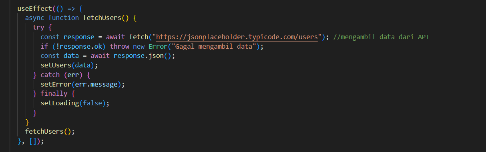
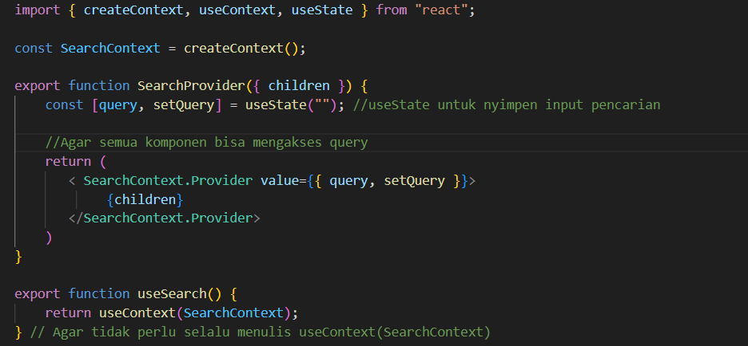
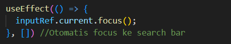
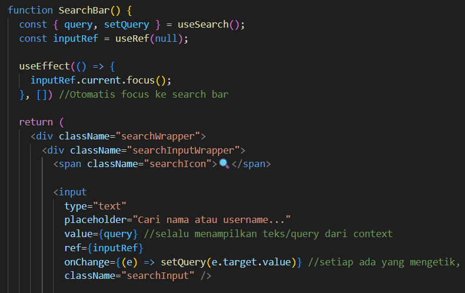
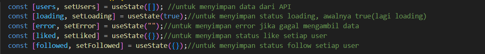

# - Penjelasan Fetch API

Menggunakan async function agar bisa menggunakan "await", sehingga kode tetap aman walau data tidak berhasil didapatkan dari API

# - Penjelasan Komponen
## 1. FetchAndCreatecard.jsx
Merupakan komponen utama dari seluruh program, berisi kode untuk mengambil data dari API serta menampilkan profile user besertar search bar.
## 2. SearchBar.jsx
Merupakan komponen yang berisi kode bentuk searchbar, sebelum ditampilkan di FetchAndCreateCard.jsx
## 3. SearchContext.jsx
Merupakan komponen useContext, yang berfungsi untuk memberikan akses global kepada data "query" atau teks yang diketik di search bar.

# - Implementasi React Hook
## useContext

## useEffect

## useRef

## useState
